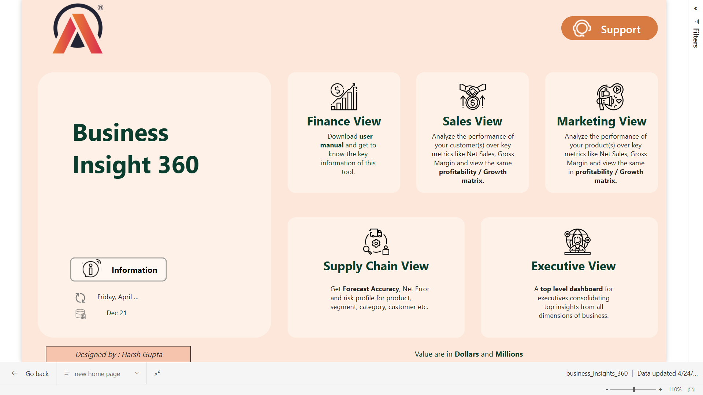
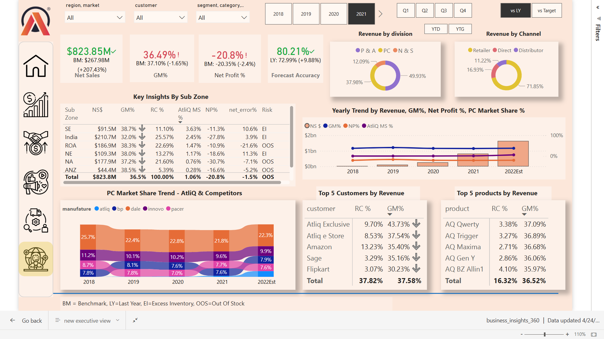
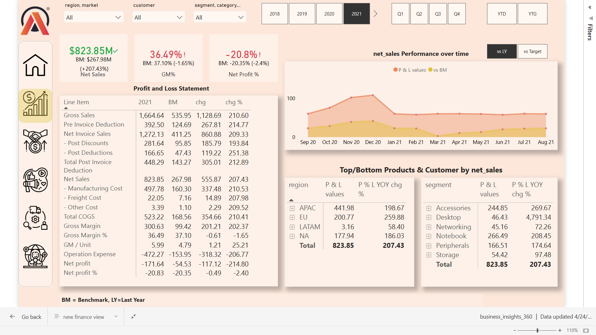
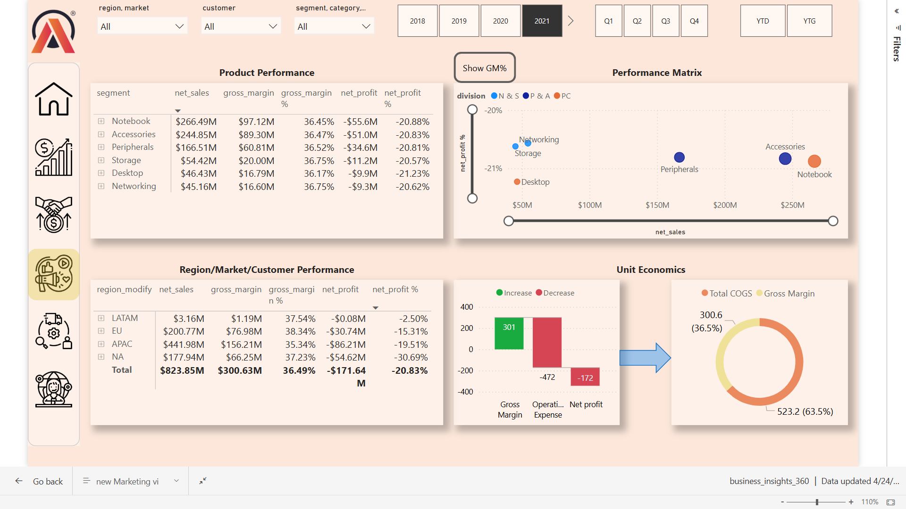
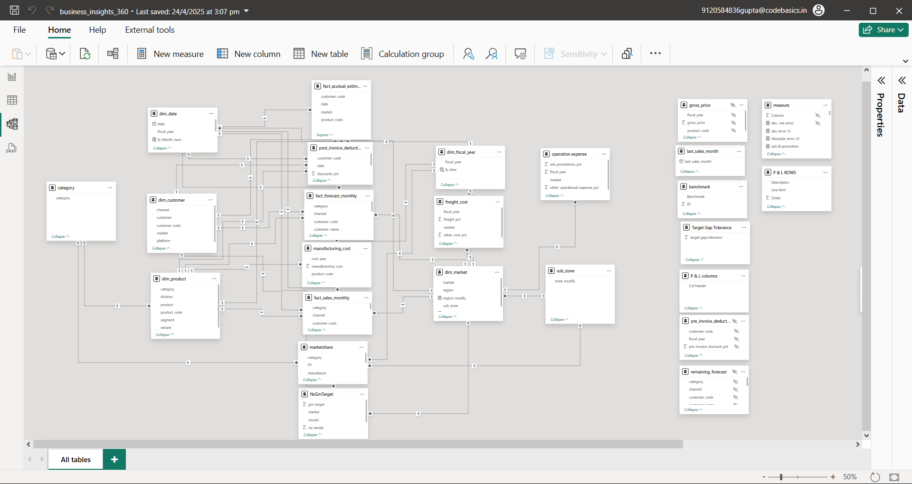
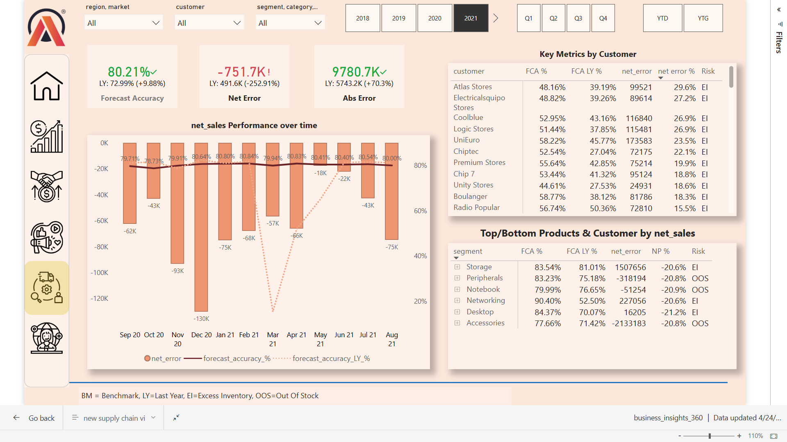
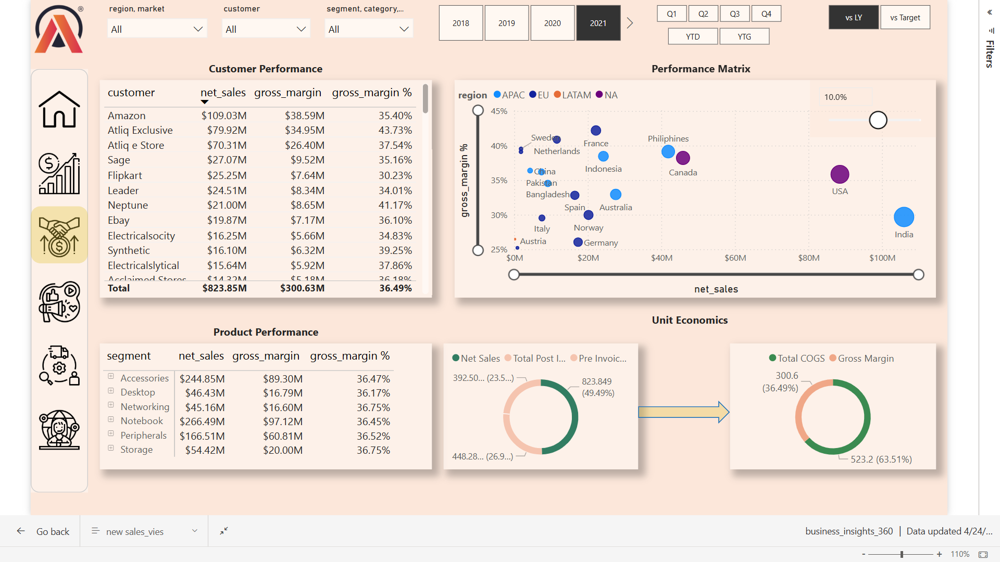
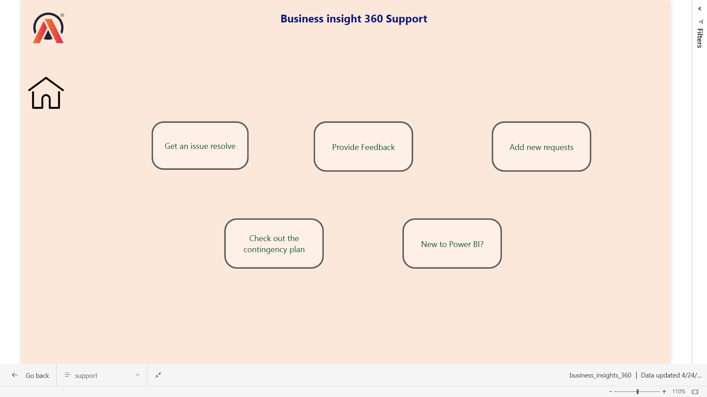
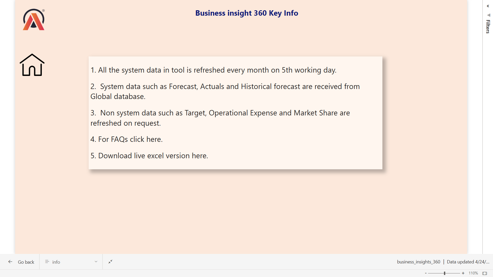

# 📊 Business Insights 360 – Power BI Project

## 🏢 Company: AtliQ Hardware  

---

## 📌 Project Overview

AtliQ Hardware is a rapidly growing company that recently initiated its data analytics journey using Power BI. This project provides a 360° view of business performance across **Finance**, **Sales**, **Marketing**, and **Supply Chain** functions. It enables stakeholders to make informed, data-driven decisions and reduces reliance on intuition and basic Excel analyses.

🔗 Business Insights 360 Dashboard :(https://bit.ly/43zzZOZ)
---

## ⚙️ Tech Stack

- **SQL** – Data extraction from MySQL
- **Power BI Desktop** – Report development
- **DAX** – Custom calculations and KPIs
- **DAX Studio** – Performance optimization
- **Excel** – Pre-processing and validation

---

## 🎓 Key Learnings & Power BI Features

- Stakeholder requirement gathering
- Calculated columns and measures using DAX
- Snowflake data modeling best practices
- Bookmarks and page navigation
- Date table creation with M Language
- Dynamic visuals and titles using filters
- Conditional formatting and KPI indicators
- Data validation techniques
- Power BI Service deployment and auto-refresh via personal gateway
- Workspace management and app creation

---

## 🧠 Business Concepts

- **Financial Metrics**: Gross Price, Net Sales, Net Profit, COGS, Gross Margin
- **Time-Based Metrics**: YTD (Year to Date), YTG (Year to Go)
- **Sales Channels**: Retailers, Distributors, Direct
- **Customer Types**: Brick & Mortar, E-commerce

---

## 🧩 Data Model

- **Schema Sources**: `gdb041`, `gdb056`
- **Dim Tables**: Customers, Markets, Products
- **Fact Tables**: Sales, Forecasts, Freight Cost, Gross Price, Manufacturing Cost, Pre & Post Invoice Deductions
- **Model Type**: Snowflake Schema
- **Database**: MySQL (imported via connector)

---

## 📸 Dashboard Preview – Business Insights 360

### 🏠 Home Page View  

### 🧑‍💼 Executive View  

### 💰 Finance View  

### 📊 Marketing View  

### 🔄 Model View  

### 🏗️ Supply Chain View  

### 📈 Sales View  

### 🤝 Support View  

### ℹ️ Info Page  

---

## ❓ Questions to Ask Before Project Kickoff

- What is the **objective** of this dashboard?
- How will **success** be measured?
- What is the **timeline** and deadline?
- Are **previews** or prototypes needed?
- What are the **hopes and fears** of stakeholders?
- Who are the **users**, and what will they use the dashboard for?
- What **data sources** and **resources** are required?
- Any **design inputs** or brand requirements from stakeholders?

---

## 🎯 Project Outcome

This Power BI dashboard provides AtliQ Hardware with a strategic decision-making tool that brings clarity across functions. It supports improved forecasting, operational efficiency, and competitive advantage through real-time analytics and intuitive visual storytelling.

---

## 📌 Notes

- 🔐 Data used is for learning/demo purposes only.

